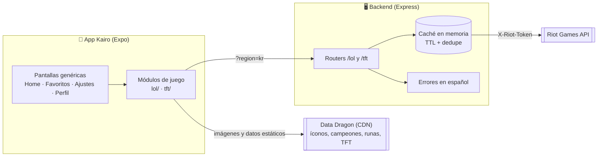
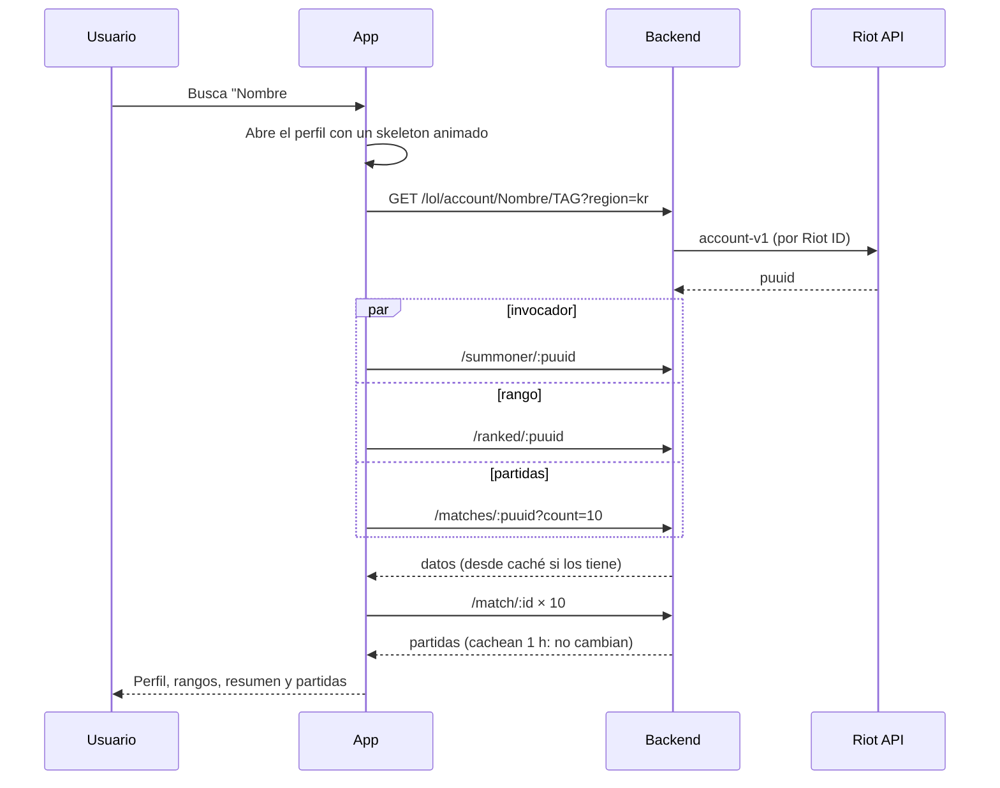

# Arquitectura

Kairo tiene dos piezas: una **app** (React Native + Expo) y un **backend** (Express) que hace de proxy a la API de Riot. La key de Riot vive solo en el backend.



## Flujo de un perfil



Si el rango falla, el perfil se muestra igual con un aviso; si falla el resto, se muestra un error con botón de reintentar.

## Arranque de la app

`useBoot` ejecuta las tareas en paralelo y expone un progreso **real** que alimenta la pantalla de carga (mínimo ~1,8 s):

| Tarea | Qué hace |
|-------|----------|
| `fonts` | Carga Sora e Inter |
| `dataDragon` | Lee la versión vigente y la lista de campeones (con respaldo en AsyncStorage) |
| `favorites` | Migra claves antiguas y favoritos sin `gameId`/región |
| `prefs` | Último juego, región y vibración |
| `recents` | Búsquedas recientes |
| `server` | Ping a `/health`. Si falla, no bloquea: Home muestra un aviso |

Cada tarea tiene un límite de 6 s y un valor por defecto si falla.

## Módulos de juego

Las pantallas genéricas **no conocen ningún juego**: leen todo de `src/games/`.

```
src/games/
  registry.js      metadatos de todos los juegos (sin dependencias; el tema lo usa para el acento)
  index.js         módulos completos + getGame() + juegos "próximamente"
  lol/ tft/ brawlstars/ clashroyale/ clashofclans/   un módulo por juego
    meta.js        id, nombre, acento, placeholder, available (+ tagSearch, hasRegion en Supercell)
    index.js       api.search, getProfile, toFavorite, ProfileBody
```

Contrato de un módulo:

| Campo | Descripción |
|-------|-------------|
| `id`, `name`, `short`, `accent` | Identidad del juego (vienen de `meta.js`) |
| `api.search(gameName, tagLine, region)` | Devuelve al menos `{ account: { gameName, tagLine, puuid }, region }` más los datos propios del juego (en Riot: `summoner`, `ranked`, `matches`…; en Supercell: `player`, `battles`) |
| `getProfile(data)` | `{ avatar, name, tag, subtitle, ranked, badge? }` para la cabecera (`badge` es el texto de la insignia cuando no hay rango) |
| `toFavorite(data)` | Lo que se guarda al marcar favorito |
| `ProfileBody({ data, setData, setError, mine })` | Contenido propio del juego |

## Backend

```
server/
  index.js          arranque, /health, montaje de routers y alias antiguos
  lib/regions.js    región → clúster de Riot (americas, europe, asia, sea)
  lib/cache.js      caché con TTL, límite de entradas y dedupe de peticiones en curso
  lib/riot.js       cliente de Riot, HttpError, errores en español, manejador central
  routes/           gameRouter.js (fábrica) + lol.js + tft.js
```

| Dato | Caché |
|------|-------|
| Partida terminada | 1 h (no cambia) |
| Cuenta | 10 min |
| Invocador | 5 min |
| Rango | 2 min |
| Lista de IDs de partidas | 1 min |

### Cola de salida hacia Riot

La key tiene un cupo (por ejemplo 20 peticiones/s y 100 cada 2 min) compartido por **todos** los usuarios. `lib/limiter.js` pone en fila las llamadas reales a Riot y las despacha en cuanto hay hueco (ventanas deslizantes, orden FIFO), en vez de dejar que fallen con 429:

- Solo pasa por la cola lo que no está en caché.
- Si Riot responde 429, se pausan las salidas durante el `Retry-After`.
- Si una petición espera más de 20 s, o la cola pasa de 300, se rechaza con 429 ("servidor ocupado").
- Cupo configurable con `RIOT_RATE_LIMITS`; `npm test` en `server/` cubre el comportamiento.

### Juegos de Supercell

`lib/supercell.js` y `routes/supercell.js` sirven Brawl Stars, Clash Royale y Clash of Clans con la misma forma: `GET /{juego}/player/:tag` y, en los dos primeros, `GET /{juego}/battles/:tag` (siempre `{ items }`). El tag se normaliza (`#`, minúsculas, la letra O como cero) y se valida antes de llamar a Supercell. Los errores se traducen igual que los de Riot (404, 403 → `KEY_INVALID`, 429, 503 → `MAINTENANCE`). Un juego sin key responde `NOT_CONFIGURED` y `/health.games` lo marca como `false`.

En la app, estos juegos declaran `tagSearch: true` y `hasRegion: false` en su `meta.js`: la búsqueda de Inicio pide solo el `#TAG` y no muestra el selector de región. Para que las pantallas genéricas sigan sin conocer ningún juego, `search()` devuelve `{ region: "global", account: { gameName, tagLine, puuid } }` con el tag como identificador.

### Idiomas

`src/i18n/index.js` guarda los diccionarios y el idioma activo y expone `t(clave, params)` (con variables `{x}` y plurales `_one/_other`; si falta una clave usa el español). `I18nProvider` (en `App.jsx`) lee la preferencia (`auto` o un idioma) de AsyncStorage, la aplica durante el render y, al cambiarla, vuelve a pintar todo lo que use `useT()` y recarga los nombres de campeones de Data Dragon en ese idioma. Fuera de los componentes (formato, utilidades) se usa el `t` del módulo, que sigue el idioma activo. Los favoritos guardan datos (trofeos, nivel del ayuntamiento) y no texto, para que se vean en el idioma actual.

Los errores del backend llevan `code` (y `provider` cuando aplica); `errorMessage()` los traduce con `errors.<CODE>`. La ruta `/lol/status` acepta `?lang=` para devolver los títulos de mantenimiento en el idioma del usuario.

### Partida en vivo (LoL)

`GET /lol/live/:puuid` consulta Spectator-V5 y, en paralelo, el rango Solo/Dúo de cada jugador (league-v4, con la caché y la cola habituales). Que el jugador no esté jugando no es un error: responde `{ inGame: false }`. `lib/live.js` normaliza la respuesta y tiene pruebas. En la app, `LiveBanner` (en el perfil de LoL) comprueba cada minuto y abre `LiveGameScreen`, que se refresca sola cada 30 s y muestra el cronómetro.

### Qué juegos habilita la key

Riot habilita cada API por producto: una key puede consultar LoL y no TFT (403). `lib/access.js` consulta cada 10 min una cuenta pública y publica el resultado en `/health` → `games`. La app lo lee al arrancar y muestra como "PRONTO" lo que no esté disponible. Solo se marca un juego como no disponible si la cuenta de prueba se resolvió (la key es válida) y aun así la API del juego dio 403.

| Error de Riot | Respuesta del backend |
|---------------|-----------------------|
| 404 | 404 con mensaje del recurso ("Jugador no encontrado") |
| 401 / 403 | 503 "el servidor no tiene acceso a Riot" (key inválida o vencida) |
| 429 | 429 con `Retry-After` |
| Timeout | 504 |

## Sistema de diseño

Todos los colores, tamaños, espaciados y tipografías salen de `src/theme/` (no hay valores sueltos en los componentes; `npm run verify` comprueba que cada token exista).

- **Base**: casi negra con un toque verdoso (`#070C0F`), superficies en capas y bordes sutiles.
- **Acento por juego**: menta para Kairo, dorado para LoL, cian para TFT. Al cambiar de juego el acento se interpola durante 350 ms.
- **Tipografía**: Sora (títulos, con `letter-spacing` amplio) e Inter (texto).
- **Resultado**: verde/rojo para victoria/derrota; el color del rango tiñe tarjetas y resplandores.

## Decisiones

- **Valorant no está implementado**: su API de partidas requiere una *production key* aprobada por Riot.
- **El rango se pide por PUUID** (`league-v4/entries/by-puuid`): Riot ya no devuelve `id` en `summoner-v4`.
- **El PUUID depende de la API key.** Riot lo cifra por aplicación: si cambias de key, todos los PUUID cambian. Por eso los favoritos se comparan por `gameId` + Riot ID + región (no solo por PUUID) y se actualizan al abrir el perfil.
- **Cada API se habilita por producto.** Una key puede tener LoL y no TFT: Riot responde 403 y el backend lo traduce a un mensaje claro y registra qué API concreta falló (sin PUUID).
- **Los datos de TFT vienen de Data Dragon** por versión y se guardan compactos en AsyncStorage. Data Dragon solo trae los sets vigentes: las unidades de sets antiguos usan un placeholder con su nombre.
- **El detalle de partida se expande con animación** midiendo su altura real (`Expandable`), sin alturas fijas.
