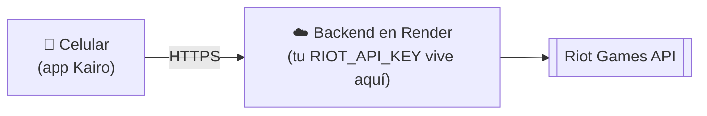

# Desplegar el backend en la nube

Para que Kairo funcione **sin tu PC encendida** hay que poner el backend (`server/`) en internet. La app ya guarda sus datos (favoritos, recientes, preferencias) en el propio celular, así que **no necesitas una base de datos**.



## Antes de empezar: la key de Riot

Es lo más importante. Una **key de desarrollo caduca cada 24 horas**: si la pones en la nube, la app dejará de funcionar al día siguiente.

| Tipo de key | Para qué sirve | Dura |
|-------------|----------------|------|
| Desarrollo | Probar en tu PC | 24 h (hay que regenerarla a mano) |
| **Personal** | Un proyecto personal, con pocos usuarios (tú y tus amigos) | No caduca cada día |
| **Producción** | Publicar la app para el público | No caduca; Riot revisa tu producto |

1. Entra a <https://developer.riotgames.com> con tu cuenta de Riot.
2. Ve a **Apps → Register Product** y elige el tipo que corresponda (Personal para empezar).
3. Describe el proyecto ("app móvil de estadísticas de LoL y TFT") y espera la aprobación. Riot decide los requisitos y plazos: revisa las condiciones en el portal.
4. Cuando la aprueben, copia esa key. **Es la que pondrás en el hosting.**

Mientras esperas, puedes desplegar con una key de desarrollo para comprobar que todo funciona; solo recuerda que caducará.

## Opción recomendada: Render (con `render.yaml`)

El repo ya incluye [`render.yaml`](../render.yaml): Render lee ese archivo y crea el servicio solo.

1. Crea una cuenta en <https://render.com> e inicia sesión **con GitHub**.
2. **New → Blueprint** y elige el repositorio de Kairo.
3. Render detecta `render.yaml` y te pide un único valor: **`RIOT_API_KEY`**. Pega tu key (no queda en git).
4. Pulsa **Apply** y espera a que termine el despliegue (1-3 minutos).
5. Copia la URL pública, algo como `https://kairo-api-xxxx.onrender.com`, y compruébala:

   ```bash
   curl https://TU-URL.onrender.com/health
   # {"ok":true,"uptime":12,"cacheEntries":0,"regions":[...],"defaultRegion":"la1"}

   curl "https://TU-URL.onrender.com/lol/account/Hide%20on%20bush/KR1?region=kr"
   # {"puuid":"...","gameName":"Hide on bush","tagLine":"KR1"}
   ```

Con `autoDeploy: true`, cada `git push` a `main` redespliega el backend.

### Cambiar o renovar la key

Render → tu servicio → **Environment** → edita `RIOT_API_KEY` → **Save**. Se redespliega solo.

### El plan gratuito se "duerme"

En el plan gratuito de Render el servicio se apaga tras ~15 minutos sin tráfico y la **primera petición tarda 30-60 segundos** en despertarlo. En la app verás "Sin conexión con el servidor" al abrirla; toca el aviso para reintentar pasado un momento.

Para evitarlo:
- Usa un monitor gratuito (por ejemplo UptimeRobot) que llame a `https://TU-URL.onrender.com/health` cada 5 minutos, o
- pasa a un plan de pago (el más barato no se duerme).

## Alternativas

El backend incluye un [`Dockerfile`](../server/Dockerfile), así que funciona en cualquier sitio con Docker o Node.

**Railway**: *New Project → Deploy from GitHub repo*, en *Settings* pon **Root Directory** `server` y añade la variable `RIOT_API_KEY`.

**Fly.io**:
```bash
cd server
fly launch --no-deploy          # acepta el Dockerfile
fly secrets set RIOT_API_KEY=RGAPI-...
fly deploy
```

> El Dockerfile no se pudo probar localmente (no había Docker instalado en la máquina de desarrollo). Si el primer despliegue falla, revisa los logs del build.

## Conectar la app al backend en la nube

La app lee la URL de la variable `EXPO_PUBLIC_API_URL` **al compilar**, así que hay que definirla antes de arrancar Expo o de generar el APK.

**Probar con Expo Go**
```bash
EXPO_PUBLIC_API_URL=https://TU-URL.onrender.com npx expo start
```

**APK / build de producción**: edita `EXPO_PUBLIC_API_URL` en el perfil `production` (o `preview`) de [`eas.json`](../eas.json) y compila:
```bash
eas build -p android --profile production
```

Con una URL `https://`, el APK **no** habilita el tráfico HTTP sin cifrar (`app.config.js` solo lo activa para URLs `http://`).

## Variables del backend

| Variable | Por defecto | Para qué |
|----------|-------------|----------|
| `RIOT_API_KEY` | (obligatoria) | Tu key de Riot |
| `PORT` | `3000` | Puerto (los hostings lo definen solos) |
| `DEFAULT_REGION` | `la1` | Región si la app no envía `?region=` |
| `RATE_LIMIT_PER_MIN` | `240` | Peticiones por minuto y por IP. Un perfil completo hace ~14 |
| `CORS_ORIGINS` | vacío (abierto) | Orígenes web permitidos, separados por comas. Las apps nativas no lo necesitan |
| `TRUST_PROXY` | `1` en producción | Proxies delante del servidor, para ver la IP real del cliente |

## Qué protege el backend

- **Límite de peticiones por IP** (responde 429 con `Retry-After` y un mensaje en español).
- **Caché en memoria**: partidas terminadas 1 h, cuenta 10 min, rango 2 min. Reduce las llamadas a Riot y protege el límite de tu key.
- **Validación** de región, PUUID e ID de partida, y `count` limitado a 20.
- **Cabeceras de seguridad** y sin `X-Powered-By`.
- **Registro** de cada petición con los IDs largos enmascarados.
- **Cierre limpio** al recibir SIGTERM (redespliegues sin cortar peticiones).

## Ojo con…

- **La caché se vacía al reiniciar** el servicio (y cada instancia tiene la suya). Es normal: solo cuesta unas llamadas extra a Riot.
- **El límite de tu key de Riot** (por ejemplo 20 peticiones/segundo y 100 cada 2 minutos en una key de desarrollo) es compartido por todos tus usuarios. Si la app crece, pide una key de producción.
- **Si el backend responde 503 "no tiene acceso a Riot"**, la key es inválida o expiró: renuévala en Render.
- **Nunca** pongas la key en la app, en `eas.json` ni en el repositorio.

## ¿Y una base de datos?

Hoy no hace falta. Tendría sentido si quisieras:

- **Favoritos sincronizados entre dispositivos**: requiere cuentas de usuario (login) y una base de datos (por ejemplo Postgres con Supabase).
- **Caché que sobreviva a los reinicios** (Redis o Postgres).
- **Historial propio** (por ejemplo LP a lo largo del tiempo), porque Riot solo entrega las partidas recientes.

Están anotados en [PENDIENTES.md](PENDIENTES.md).

## Lista de comprobación

- [ ] Key de Riot personal o de producción aprobada
- [ ] Backend desplegado y `/health` responde
- [ ] Una búsqueda real por `curl` funciona
- [ ] `EXPO_PUBLIC_API_URL` apunta a la URL `https://`
- [ ] Monitor de `/health` si usas el plan gratuito
- [ ] `CORS_ORIGINS` definido si algún día sirves una versión web
