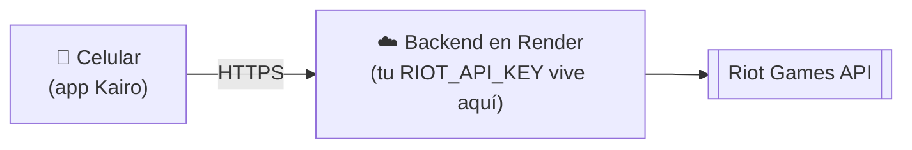

# Desplegar el backend en la nube

Para que Kairo funcione **sin tu PC encendida** hay que poner el backend (`server/`) en internet. La app ya guarda sus datos (favoritos, recientes, preferencias) en el propio celular, así que **no necesitas una base de datos**.



## Antes de empezar: la key de Riot

Es lo más importante. Una **key de desarrollo caduca cada 24 horas**: si la pones en la nube, la app dejará de funcionar al día siguiente.

| Tipo de key | Para qué sirve | Dura |
|-------------|----------------|------|
| Desarrollo | Probar en tu PC | 24 h (hay que regenerarla a mano) |
| **Personal** | Un proyecto personal, con pocos usuarios (tú y tus amigos) | No caduca cada día |
| **Producción** | Publicar la app para el público | No caduca; Riot revisa tu producto |

1. Entra a <https://developer.riotgames.com> con tu cuenta de Riot.
2. Ve a **Apps → Register Product** y elige el tipo que corresponda (Personal para empezar).
3. Describe el proyecto ("app móvil de estadísticas de LoL y TFT") y espera la aprobación. Riot decide los requisitos y plazos: revisa las condiciones en el portal.
4. Cuando la aprueben, abre tu app en el portal y **revisa qué APIs tiene habilitadas** (LoL, TFT…): la aprobación puede cubrir solo algunas. Una API no habilitada responde 403 aunque la key sea válida.
5. Copia la key. **Es la que pondrás en el hosting.** Nunca la pegues en un chat: si se expone, regenérala en el portal.

> **Ojo:** el PUUID de un jugador cambia al cambiar de key (Riot lo cifra por aplicación). Es normal; la app lo tolera.

Mientras esperas, puedes desplegar con una key de desarrollo para comprobar que todo funciona; solo recuerda que caducará.

## Opción recomendada: Render (con `render.yaml`)

El repo ya incluye [`render.yaml`](../render.yaml): Render lee ese archivo y crea el servicio solo.

1. Crea una cuenta en <https://render.com> e inicia sesión **con GitHub**.
2. **New → Blueprint** y elige el repositorio de Kairo.
3. Render detecta `render.yaml` y te pide un único valor: **`RIOT_API_KEY`**. Pega tu key (no queda en git).
4. Pulsa **Apply** y espera a que termine el despliegue (1-3 minutos).
5. Copia la URL pública, algo como `https://kairo-api-xxxx.onrender.com`, y compruébala:

   ```bash
   curl https://TU-URL.onrender.com/health
   # {"ok":true,"uptime":12,"cacheEntries":0,"regions":[...],"defaultRegion":"la1"}

   curl "https://TU-URL.onrender.com/lol/account/Hide%20on%20bush/KR1?region=kr"
   # {"puuid":"...","gameName":"Hide on bush","tagLine":"KR1"}
   ```

Con `autoDeploy: true`, cada `git push` a `main` redespliega el backend.

### Cambiar o renovar la key

Render → tu servicio → **Environment** → edita `RIOT_API_KEY` → **Save**. Se redespliega solo.

### El plan gratuito se "duerme"

En el plan gratuito de Render el servicio se apaga tras ~15 minutos sin tráfico y la **primera petición tarda 30-60 segundos** en despertarlo. En la app verás "Sin conexión con el servidor" al abrirla; toca el aviso para reintentar pasado un momento.

Para evitarlo:
- Usa un monitor gratuito (por ejemplo UptimeRobot) que llame a `https://TU-URL.onrender.com/health` cada 5 minutos, o
- pasa a un plan de pago (el más barato no se duerme).

## Base de datos para las notificaciones (Neon)

El registro de dispositivos (`/devices`) guarda el token de notificaciones, los favoritos vigilados y los ajustes de cada celular. Sin cuentas: al registrarse, cada dispositivo recibe un secreto propio que el servidor guarda con hash.

- **Sin `DATABASE_URL`** se usa un archivo JSON (`server/data/devices.json`). Sirve en local; en Render gratis el disco se borra al reiniciar, así que allí se perderían los registros.
- **Con `DATABASE_URL`** se usa Postgres. Pasos con Neon (gratis):
  1. Crea una cuenta en <https://neon.tech> y un proyecto (región cercana a la de Render).
  2. Copia la cadena de conexión (*Connection string*, con `sslmode=require`).
  3. En Render, *Environment*, añade `DATABASE_URL` con esa cadena y guarda: el servicio se reinicia solo. La tabla se crea sola al arrancar.
- El registro está limitado por IP (20 altas por hora) y por total (`MAX_DEVICES`, 5000 por defecto) para no agotar el plan gratuito.
- Si la base falla al arrancar, el resto de la API sigue funcionando y solo `/devices` responde 503.

## Vigilante de partidas y notificaciones (solo LoL)

Con el servidor encendido, un vigilante revisa cada 2 minutos a los favoritos con alertas de todos los dispositivos (cada jugador se consulta una sola vez aunque lo sigan varios) y manda las notificaciones por Expo Push: una al entrar en partida y otra al terminar, con el resultado.

- **Presupuesto:** máximo `WATCH_MAX_PER_TICK` consultas a Riot por tanda (40 por defecto, menos de la mitad del cupo de 95 cada 2 min); si hay más jugadores, se rotan. Se detiene si Riot devuelve 403 o 429.
- **Sin repetir avisos:** el estado de cada jugador (partida ya avisada, resultados pendientes) se guarda en la base, así que reiniciar el servidor no duplica nada.
- **Tokens muertos:** si Expo indica `DeviceNotRegistered` (app desinstalada), el dispositivo se da de baja solo.
- **Android:** las push necesitan Firebase (FCM V1). El archivo `google-services.json` va como variable de archivo `GOOGLE_SERVICES_JSON` en EAS (entorno `preview`) y la llave de la cuenta de servicio se sube en expo.dev, *Credentials*, Android, *FCM V1 service account key*. Ninguno de los dos va en git.
- **Probar sin esperar una partida:** `POST /devices/me/test` (con el encabezado del dispositivo) manda una notificación de prueba a ese celular; `{"type":"live_start"}` o `{"type":"live_end"}` muestran cómo se verían los avisos reales.
- `/health` incluye el estado del vigilante (`watcher`). Se apaga con `WATCHER_ENABLED=false`.

## Publicar una versión (APK)

Las versiones las publica el flujo [`.github/workflows/release.yml`](../.github/workflows/release.yml): al subir una etiqueta `v*` construye el APK con EAS y lo adjunta a una *release* de GitHub, que es de donde lo descargan el botón del README y [Obtainium](https://github.com/ImranR98/Obtainium).

1. Crea un token en <https://expo.dev/settings/access-tokens> y guárdalo en el repositorio como secreto `EXPO_TOKEN` (*Settings → Secrets and variables → Actions*). Nunca en el código.
2. Sube la versión en `package.json` y `app.json`, haz commit y crea la etiqueta: `git tag v1.1.0 && git push origin v1.1.0`.
3. El flujo espera a EAS (la cola gratuita puede tardar más de una hora) y publica `Kairo-v1.1.0.apk` en *Releases*.

También puedes lanzarlo a mano desde la pestaña *Actions* con la etiqueta que quieras. Mientras no exista ninguna release, el botón "Descargar APK" del README no tiene a dónde apuntar.

## Generar el APK con EAS

Hazlo **después** de desplegar el backend, para que el APK ya apunte a la nube.

1. Pon la URL `https://…` de Render en `EXPO_PUBLIC_API_URL` dentro de los perfiles `preview` y `production` de [`eas.json`](../eas.json).
2. En tu terminal:
   ```bash
   npm install -g eas-cli
   eas login                                     # tu cuenta de expo.dev (créala gratis)
   eas init                                      # crea el proyecto "kairo" y guarda su projectId en app.json
   eas build -p android --profile preview        # genera un APK instalable
   ```
3. La primera vez EAS pregunta por la *keystore* de Android: elige **generar una nueva** y déjala guardada en EAS (sin ella no podrás actualizar la app publicada).
4. Espera la cola y el build (10-20 minutos en el plan gratuito). Al terminar te da un enlace y un QR: ábrelo en el celular para descargar el APK e instalarlo (habilita "instalar apps desconocidas" si Android lo pide).

Para Google Play se usa el perfil `production` (genera un `.aab`): `eas build -p android --profile production`.

> El identificador de la app es `com.camavingaaa.kairo` (en `app.json`). Cámbialo **antes** de tu primera publicación si quieres otro: después no se puede.

## Alternativas

El backend incluye un [`Dockerfile`](../server/Dockerfile), así que funciona en cualquier sitio con Docker o Node.

**Railway**: *New Project → Deploy from GitHub repo*, en *Settings* pon **Root Directory** `server` y añade la variable `RIOT_API_KEY`.

**Fly.io**:
```bash
cd server
fly launch --no-deploy          # acepta el Dockerfile
fly secrets set RIOT_API_KEY=RGAPI-...
fly deploy
```

> El Dockerfile no se pudo probar localmente (no había Docker instalado en la máquina de desarrollo). Si el primer despliegue falla, revisa los logs del build.

## Conectar la app al backend en la nube

La app lee la URL de la variable `EXPO_PUBLIC_API_URL` **al compilar**, así que hay que definirla antes de arrancar Expo o de generar el APK.

**Probar con Expo Go**
```bash
EXPO_PUBLIC_API_URL=https://TU-URL.onrender.com npm run phone
```

**APK / build de producción**: edita `EXPO_PUBLIC_API_URL` en el perfil `production` (o `preview`) de [`eas.json`](../eas.json) y compila:
```bash
eas build -p android --profile production
```

Con una URL `https://`, el APK **no** habilita el tráfico HTTP sin cifrar (`app.config.js` solo lo activa para URLs `http://`).

## Keys de Supercell (Brawl Stars, Clash Royale, Clash of Clans)

Son opcionales e independientes de la de Riot. Cada una se crea en su portal de desarrolladores (con tu cuenta de Supercell ID):

- Brawl Stars: <https://developer.brawlstars.com>
- Clash Royale: <https://developer.clashroyale.com>
- Clash of Clans: <https://developer.clashofclans.com>

La key de Supercell **se ata a las IP que le permitas** y Render gratis no tiene IP fija. Por eso el backend usa por defecto los proxies comunitarios de RoyaleAPI, que salen siempre desde la misma IP: al crear cada key, en *Allowed IP addresses* pon `45.79.218.79`. Después añade la key como variable de entorno en Render (`BRAWLSTARS_API_KEY`, `CLASHROYALE_API_KEY`, `CLASHOFCLANS_API_KEY`); nunca en el código ni en git. Con `/health` compruebas que `games` las muestre como `true`.

Si prefieres no depender del proxy, usa un servidor con IP fija, permite esa IP y define `*_API_BASE` con la URL oficial (`https://api.brawlstars.com/v1`, `https://api.clashroyale.com/v1`, `https://api.clashofclans.com/v1`).

## Keys de Dota 2, Fortnite, Apex Legends y PUBG

Dota 2 (OpenDota) **no necesita key**: funciona desde el primer día (60 peticiones por minuto; con `OPENDOTA_API_KEY` suben). Los otros tres piden una key gratuita:

- Fortnite (Fortnite-API): <https://dash.fortnite-api.com>, con tu cuenta de Discord. Variable `FORTNITE_API_KEY`.
- Apex Legends (Apex Legends Status): <https://portal.apexlegendsapi.com>, con tu cuenta de Discord. Variable `APEX_API_KEY`.
- PUBG (API oficial): <https://developer.pubg.com>. Variable `PUBG_API_KEY`. Su límite es de 10 peticiones por minuto en todo salvo las partidas.

Añádelas en Render como el resto (nunca en git). Estas APIs no atan la key a una IP, así que no hace falta ningún proxy. Cada juego aparece en la app solo cuando su key está puesta: `/health` → `games` lo muestra.

## Variables del backend

| Variable | Por defecto | Para qué |
|----------|-------------|----------|
| `RIOT_API_KEY` | (obligatoria) | Tu key de Riot |
| `PORT` | `3000` | Puerto (los hostings lo definen solos) |
| `DEFAULT_REGION` | `la1` | Región si la app no envía `?region=` |
| `RATE_LIMIT_PER_MIN` | `240` | Peticiones por minuto y por IP. Un perfil completo hace ~14 |
| `CORS_ORIGINS` | vacío (abierto) | Orígenes web permitidos, separados por comas. Las apps nativas no lo necesitan |
| `TRUST_PROXY` | `1` en producción | Proxies delante del servidor, para ver la IP real del cliente |
| `RIOT_RATE_LIMITS` | `18:1,95:120` | Cupo hacia Riot (`peticiones:segundos`); pon el de tu key un poco por debajo |
| `PROBE_RIOT_ID` | `Hide on bush#KR1@kr` | Cuenta pública para detectar qué juegos habilita la key |
| `BRAWLSTARS_API_KEY`, `CLASHROYALE_API_KEY`, `CLASHOFCLANS_API_KEY` | (vacías) | Keys de Supercell; cada juego se activa solo al ponerla |
| `FORTNITE_API_KEY`, `APEX_API_KEY`, `PUBG_API_KEY` | (vacías) | Keys gratuitas de Fortnite-API, Apex Legends Status y PUBG |
| `OPENDOTA_API_KEY` | (vacía) | Opcional: Dota 2 funciona sin key |
| `BRAWLSTARS_API_BASE`, `CLASHROYALE_API_BASE`, `CLASHOFCLANS_API_BASE` | proxies de RoyaleAPI | URL base de cada API (usa la oficial solo si tu servidor tiene IP fija) |

## Qué protege el backend

- **Límite de peticiones por IP** (responde 429 con `Retry-After` y un mensaje en español).
- **Caché en memoria**: partidas terminadas 1 h, cuenta 10 min, rango 2 min. Reduce las llamadas a Riot y protege el límite de tu key.
- **Validación** de región, PUUID e ID de partida, y `count` limitado a 20.
- **Cabeceras de seguridad** y sin `X-Powered-By`.
- **Registro** de cada petición con los nombres de jugador y los IDs largos enmascarados.
- **Cierre limpio** al recibir SIGTERM (redespliegues sin cortar peticiones).

## Ojo con…

- **La caché se vacía al reiniciar** el servicio (y cada instancia tiene la suya). Es normal: solo cuesta unas llamadas extra a Riot.
- **El límite de tu key de Riot** (por ejemplo 20 peticiones/segundo y 100 cada 2 minutos en una key de desarrollo) es compartido por todos tus usuarios. Si la app crece, pide una key de producción.
- **Si el backend responde 503 "no tiene acceso a Riot"**, la key es inválida o expiró: renuévala en Render.
- **Nunca** pongas la key en la app, en `eas.json` ni en el repositorio.

## ¿Y una base de datos?

Hoy no hace falta. Tendría sentido si quisieras:

- **Favoritos sincronizados entre dispositivos**: requiere cuentas de usuario (login) y una base de datos (por ejemplo Postgres con Supabase).
- **Caché que sobreviva a los reinicios** (Redis o Postgres).
- **Historial propio** (por ejemplo LP a lo largo del tiempo), porque Riot solo entrega las partidas recientes.

Están anotados en [PENDIENTES.md](PENDIENTES.md).

## Lista de comprobación

- [ ] Key de Riot personal o de producción aprobada
- [ ] Backend desplegado y `/health` responde
- [ ] Una búsqueda real por `curl` funciona
- [ ] `EXPO_PUBLIC_API_URL` apunta a la URL `https://`
- [ ] Monitor de `/health` si usas el plan gratuito
- [ ] `CORS_ORIGINS` definido si algún día sirves una versión web
